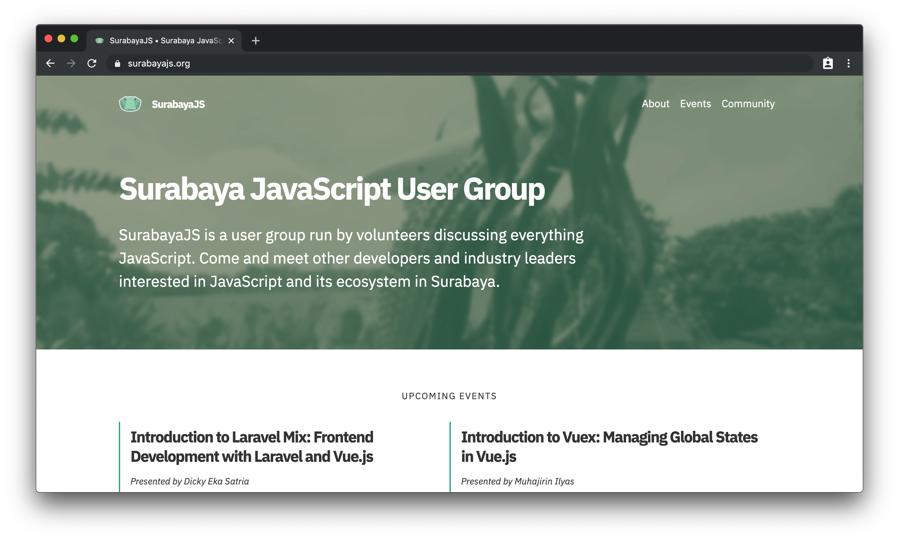

<!-- markdownlint-disable MD033 -->

# [surabayajs.org](https://surabayajs.org)

Repository for SurabayaJS landing page 🐊

Made with [Tachyons](https://tachyons.io) and [Gatsby.js](https://gatsbyjs.org). Hosted on [ZEIT Now](https://zeit.co/now).  
Source code licensed under the [MIT License](./LICENSE).

# Contributing

The canonical repository for this project can be found at [SurabayaJS/website](https://github.com/SurabayaJS/website) on Github.

# Development

To set up and start the development server, run `yarn install && yarn develop`.
